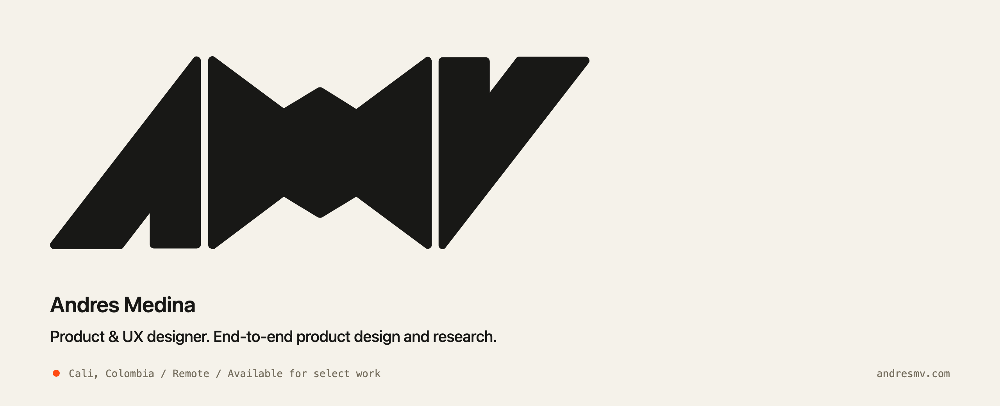

<p align="center">
  <a href="https://andresmv.com">
    
  </a>
</p>

<br/>

 From **Cali, Colombia**. Remote. Available for select work.

I design products end-to-end: research, UX, the parts that ship. And I build them.

Most of what gets called taste online is reference with confidence.  
I try to wear a dirt road instead.

---

###  The real surface

**[andresmv.com](https://andresmv.com)** is the portfolio.  
Case studies. The claim. The thing I'm willing to be held to.

This GitHub page is the hallway. The site is the room.

 **[Enter the portfolio](https://andresmv.com)**

---

###  Lab

Things I'm making with my hands in the code. Demos first. Repos stay private until they earn daylight.

| | Thing | What it is | Open it |
| :---: | --- | --- | --- |
|  | **holo-cards** | Physical-finish card studio. Holo, foil, material. | [open demo](https://holo-cards-iota.vercel.app) |
|  | **soltoy** | Interactive toy. Process scraps, cool moments. | [open demo](https://soltoy.vercel.app) |

---

###  Operating notes

```
imitation dressed as taste     →  the real enemy
the dirt road                  →  beats the garden path
stay until it's done           →  that's where craft lives
good work is quiet             →  so is this account, mostly
```

I don't keep a museum of half-finished clones here.  
If it's public, it earned it. If it's not, ask - or just open the demo.

---

### Elsewhere

<a href="https://andresmv.com"></a>
&nbsp;
<a href="https://www.linkedin.com/in/andresmedinav/"></a>
&nbsp;
<a href="https://github.com/amedinamv/amedinamv"></a>

```
amedinamv/
├── portfolio/   →  andresmv.com
├── lab/         →  holo · soltoy
└── soul.md      →  private. as it should be.
```
